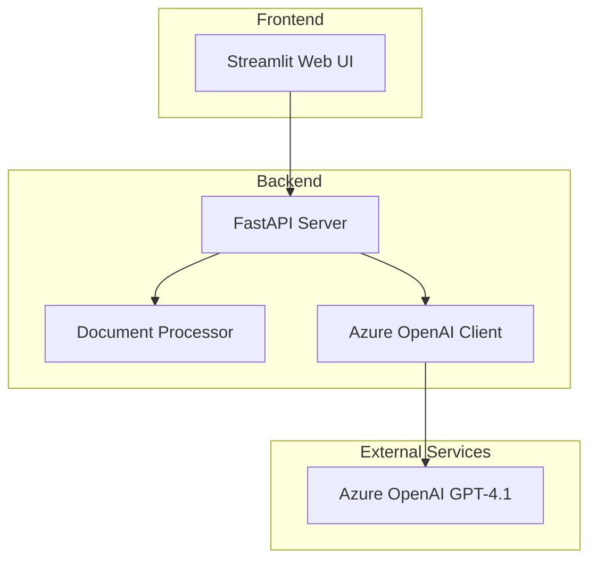

# Design Document

## Overview

한국어 문서 맞춤법 검사 AI 서비스는 Azure OpenAI GPT-4.1 모델을 활용하여 한국어 docx 파일에 대한 종합적인 품질 검사를 제공하는 웹 애플리케이션입니다. 마이크로서비스 아키텍처를 채택하여 FastAPI 백엔드와 Streamlit 프론트엔드로 분리된 구조로 설계됩니다.

## Architecture

### System Architecture



### Technology Stack

- **Backend**: FastAPI (Python 3.12)
- **Frontend**: Streamlit (Python 3.12)
- **AI Service**: Azure OpenAI GPT-4.1
- **Document Processing**: python-docx
- **Package Management**: uv
- **HTTP Client**: httpx/aiohttp
- **File Handling**: python-multipart

### Project Structure

```
korean-document-checker/
├── backend/
│   ├── app/
│   │   ├── __init__.py
│   │   ├── main.py
│   │   ├── api/
│   │   │   ├── __init__.py
│   │   │   └── endpoints/
│   │   │       ├── __init__.py
│   │   │       ├── upload.py
│   │   │       └── check.py
│   │   ├── core/
│   │   │   ├── __init__.py
│   │   │   ├── config.py
│   │   │   └── azure_client.py
│   │   ├── services/
│   │   │   ├── __init__.py
│   │   │   ├── document_processor.py
│   │   │   └── checker_service.py
│   │   └── models/
│   │       ├── __init__.py
│   │       ├── request.py
│   │       └── response.py
│   ├── pyproject.toml
│   └── uv.lock
├── frontend/
│   ├── app.py
│   ├── components/
│   │   ├── __init__.py
│   │   ├── file_upload.py
│   │   └── result_display.py
│   ├── services/
│   │   ├── __init__.py
│   │   └── api_client.py
│   ├── pyproject.toml
│   └── uv.lock
└── README.md
```

## Components and Interfaces

### Backend Components

#### 1. FastAPI Application (main.py)
- CORS 설정으로 프론트엔드 연동 지원
- 파일 업로드 크기 제한 설정
- 에러 핸들링 미들웨어

#### 2. Azure OpenAI Client (azure_client.py)
```python
class AzureOpenAIClient:
    def __init__(self, endpoint: str, api_key: str, api_version: str, deployment_name: str)
    async def analyze_document(self, content: str, check_type: str) -> dict
    async def get_comprehensive_analysis(self, content: str) -> dict
```

#### 3. Document Processor (document_processor.py)
```python
class DocumentProcessor:
    def extract_text_from_docx(self, file_path: str) -> str
    def extract_structure_info(self, file_path: str) -> dict
    def get_formatting_details(self, file_path: str) -> dict
```

#### 4. Checker Service (checker_service.py)
```python
class CheckerService:
    async def grammar_check(self, content: str) -> dict
    async def english_spell_check(self, content: str) -> dict
    async def korean_spell_check(self, content: str) -> dict
    async def layout_consistency_check(self, structure: dict) -> dict
    async def terminology_consistency_check(self, content: str) -> dict
    async def comprehensive_check(self, file_path: str) -> dict
```

### Frontend Components

#### 1. Streamlit App (app.py)
- 메인 애플리케이션 진입점
- 페이지 라우팅 및 상태 관리

#### 2. File Upload Component (file_upload.py)
```python
def render_file_upload() -> Optional[UploadedFile]
def validate_file(file: UploadedFile) -> bool
```

#### 3. Result Display Component (result_display.py)
```python
def display_check_results(results: dict) -> None
def display_summary_report(summary: dict) -> None
def display_error_details(errors: list) -> None
```

#### 4. API Client (api_client.py)
```python
class APIClient:
    def __init__(self, base_url: str)
    async def upload_file(self, file: bytes, filename: str) -> dict
    async def check_document(self, file_id: str) -> dict
```

### API Endpoints

#### POST /api/upload
- 파일 업로드 처리
- docx 파일 검증
- 임시 저장 및 파일 ID 반환

#### POST /api/check/{file_id}
- 문서 검사 실행
- 모든 검사 유형 수행
- 종합 결과 반환

#### GET /api/health
- 서비스 상태 확인
- Azure OpenAI 연결 상태 포함

## Data Models

### Request Models

```python
class FileUploadResponse(BaseModel):
    file_id: str
    filename: str
    size: int
    upload_time: datetime

class CheckRequest(BaseModel):
    file_id: str
    check_types: List[str] = ["all"]
```

### Response Models

```python
class CheckResult(BaseModel):
    check_type: str
    errors_found: int
    suggestions: List[dict]
    summary: str

class ComprehensiveReport(BaseModel):
    file_id: str
    filename: str
    total_errors: int
    check_results: List[CheckResult]
    priority_issues: List[dict]
    overall_score: float
    recommendations: List[str]
```

### Error Models

```python
class ErrorDetail(BaseModel):
    location: str
    error_type: str
    current_text: str
    suggested_text: str
    confidence: float
    explanation: str
```

## Error Handling

### Backend Error Handling

1. **File Processing Errors**
   - 잘못된 파일 형식
   - 파일 크기 초과
   - 파일 손상

2. **Azure OpenAI API Errors**
   - 인증 실패
   - 요청 한도 초과
   - 네트워크 오류
   - 모델 응답 파싱 오류

3. **Service Errors**
   - 내부 서버 오류
   - 메모리 부족
   - 타임아웃

### Frontend Error Handling

1. **Upload Errors**
   - 파일 선택 없음
   - 지원하지 않는 파일 형식
   - 네트워크 연결 오류

2. **API Communication Errors**
   - 백엔드 서버 연결 실패
   - 요청 타임아웃
   - 응답 파싱 오류

### Error Response Format

```python
class ErrorResponse(BaseModel):
    error_code: str
    message: str
    details: Optional[dict] = None
    timestamp: datetime
```

## Testing Strategy

### Unit Testing

1. **Backend Unit Tests**
   - Document processor 테스트
   - Azure OpenAI client 모킹 테스트
   - Checker service 로직 테스트
   - API endpoint 테스트

2. **Frontend Unit Tests**
   - Component 렌더링 테스트
   - API client 모킹 테스트
   - 파일 업로드 검증 테스트

### Integration Testing

1. **API Integration Tests**
   - 전체 워크플로우 테스트
   - 파일 업로드부터 결과 반환까지
   - 에러 시나리오 테스트

2. **Azure OpenAI Integration Tests**
   - 실제 API 호출 테스트
   - 다양한 문서 유형 테스트
   - 응답 시간 및 품질 테스트

### Performance Testing

1. **Load Testing**
   - 동시 파일 업로드 처리
   - 대용량 문서 처리 성능
   - 메모리 사용량 모니터링

2. **Azure OpenAI Rate Limiting**
   - API 호출 빈도 제한 테스트
   - 재시도 로직 검증

### Test Data

1. **Sample Documents**
   - 다양한 크기의 한국어 docx 파일
   - 의도적인 오류가 포함된 테스트 문서
   - 다양한 형식과 스타일의 문서

2. **Mock Responses**
   - Azure OpenAI API 응답 모킹
   - 다양한 에러 시나리오 모킹

## Security Considerations

### API Security

1. **Authentication & Authorization**
   - API 키 기반 인증 (향후 확장 가능)
   - CORS 정책 설정

2. **Input Validation**
   - 파일 형식 검증
   - 파일 크기 제한
   - 악성 파일 스캔 (향후 추가)

### Data Protection

1. **Sensitive Data Handling**
   - Azure OpenAI API 키 환경변수 관리
   - 업로드된 파일 임시 저장 후 삭제
   - 로그에서 민감 정보 제외

2. **File Storage**
   - 임시 파일 자동 정리
   - 파일 접근 권한 제한

## Configuration Management

### Environment Variables

```python
class Settings(BaseSettings):
    azure_openai_endpoint: str
    azure_openai_api_key: str
    azure_openai_api_version: str = "2024-12-01-preview"
    azure_openai_deployment_name: str = "gpt-4.1"
    max_file_size: int = 10 * 1024 * 1024  # 10MB
    temp_file_retention_hours: int = 1
    backend_url: str = "http://localhost:8000"
```

### Package Management with uv

1. **Backend pyproject.toml**
```toml
[project]
name = "korean-document-checker-backend"
version = "0.1.0"
requires-python = ">=3.12"
dependencies = [
    "fastapi>=0.104.0",
    "uvicorn>=0.24.0",
    "python-docx>=1.1.0",
    "openai>=1.3.0",
    "python-multipart>=0.0.6",
    "pydantic>=2.5.0",
    "httpx>=0.25.0"
]
```

2. **Frontend pyproject.toml**
```toml
[project]
name = "korean-document-checker-frontend"
version = "0.1.0"
requires-python = ">=3.12"
dependencies = [
    "streamlit>=1.28.0",
    "requests>=2.31.0",
    "pandas>=2.1.0"
]
```